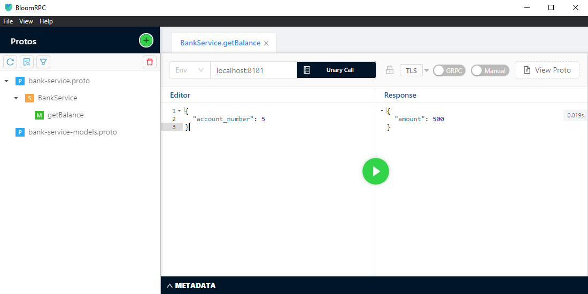

# gRPC

* High-performance, open-source RPC framework developed at Google
* Client app directly invokes Server method on a different machine
* Service is defined using proto
* REST uses HTTP verbs to work with the resource, so REST is resource oriented
* On the other hand, gRPC is "action" oriented
* Client's call to the server can be Sync/Async
  - Sync &#8594; blocking/waiting for the response
  - Async &#8594; register a listener for call back

## [RPC Types](https://grpc.io/docs/what-is-grpc/core-concepts/ "RPC Types")

1. Unary &#8594; the client sends a single request to the server and gets a single response back, just like a normal function call.
   ```
   rpc SayHello(HelloRequest) returns (HelloResponse);
   ```
2. Server-streaming &#8594; the client sends a request to the server and gets a stream to read a sequence of messages back. The client reads from the returned stream until there are no more messages. gRPC guarantees message ordering within an individual RPC call.
   ```
   rpc LotsOfReplies(HelloRequest) returns (stream HelloResponse);
   ```
3. Client-streaming &#8594; the client writes a sequence of messages and sends them to the server, again using a provided stream. Once the client has finished writing the messages, it waits for the server to read them and return its response. Again gRPC guarantees message ordering within an individual RPC call.
   ```
   rpc LotsOfGreetings(stream HelloRequest) returns (HelloResponse);
   ```
4. Bidirection-streaming &#8594; both sides send a sequence of messages using a read-write stream. The two streams operate independently, so clients and servers can read and write in whatever order they like: for example, the server could wait to receive all the client messages before writing its responses, or it could alternately read a message then write a message, or some other combination of reads and writes. The order of messages in each stream is preserved.
   ```
   rpc BidiHello(stream HelloRequest) returns (stream HelloResponse);
   ```

## bloomRPC - Postman like GUI client

Download bloomRPC from [here](https://github.com/uw-labs/bloomrpc/releases "Download bloomRPC")



